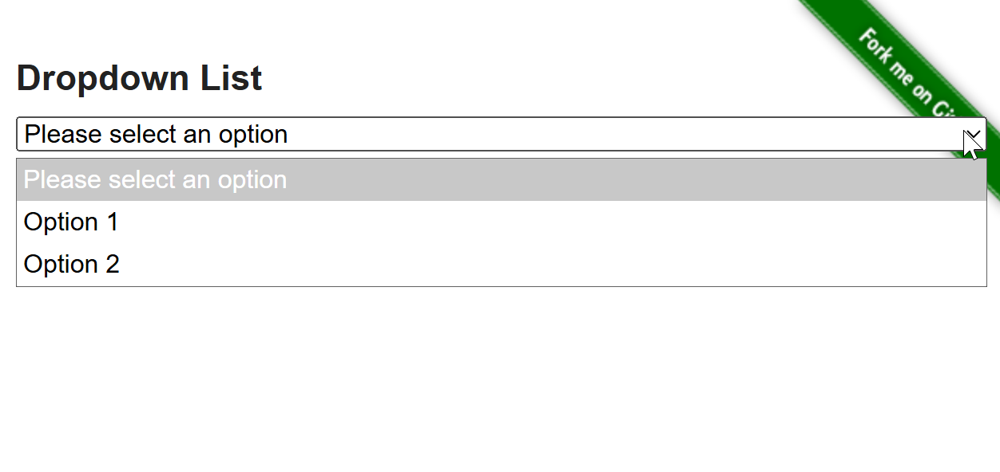
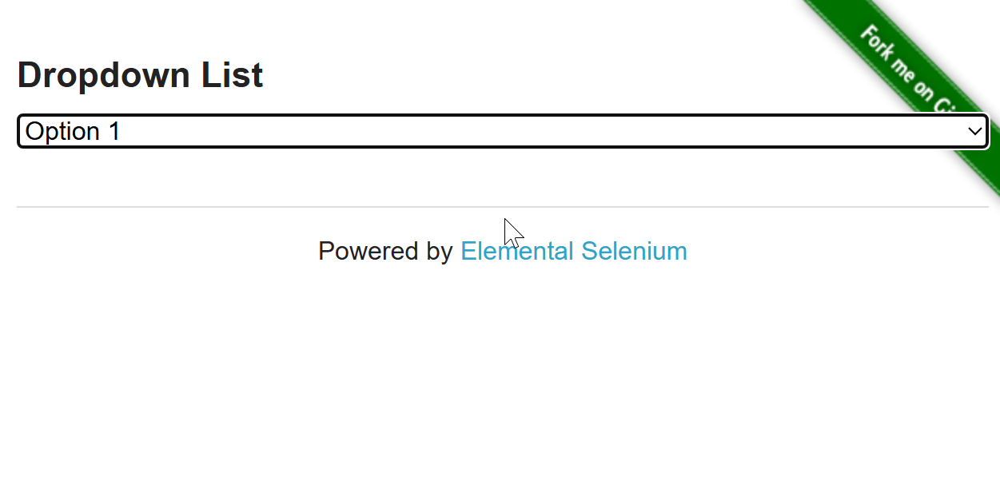
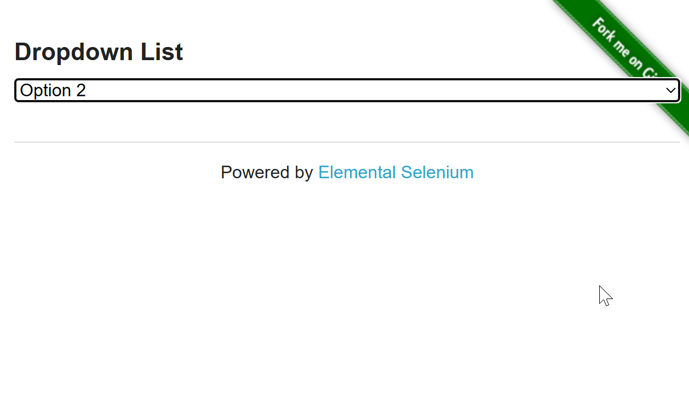
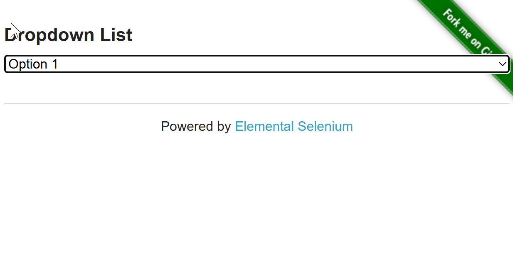
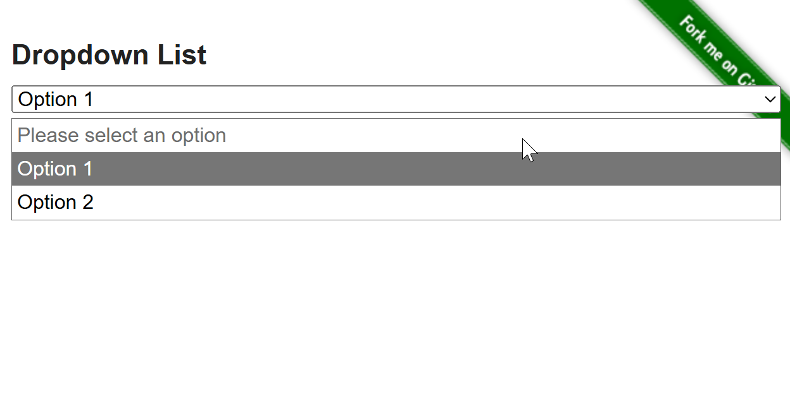
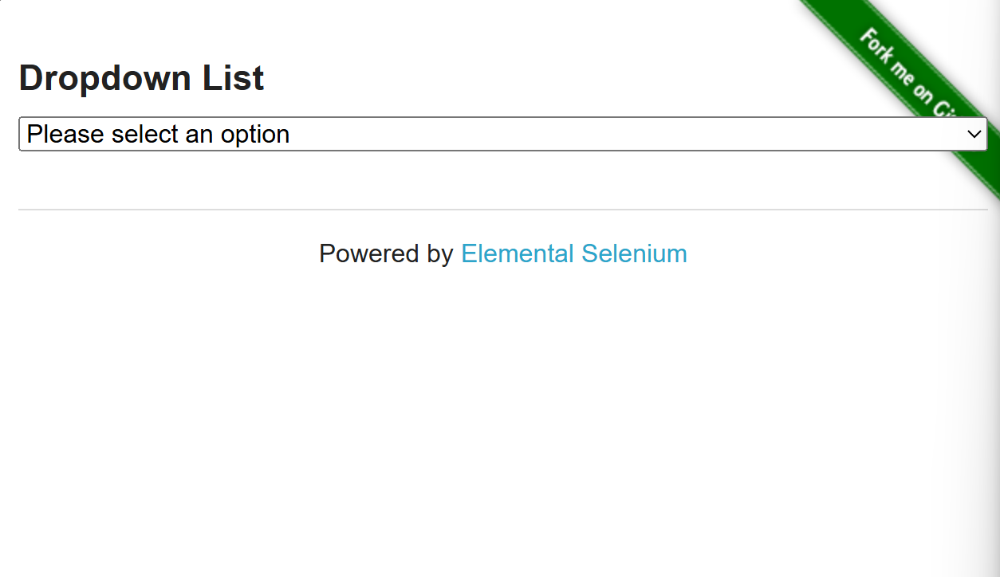
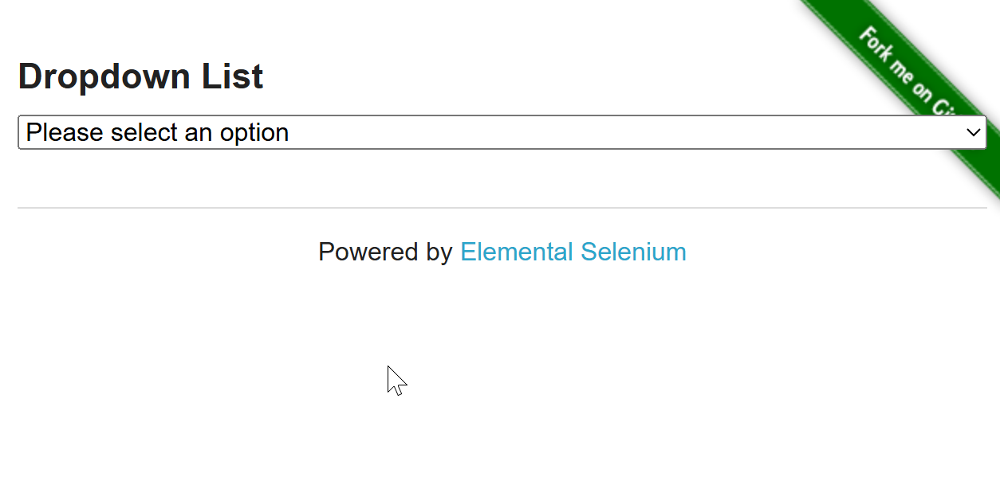

  # Exploratory Test

  ## Feature: Dropdown Selection 
  
* Scenario: Display dropdown options correctly 
    - Given the user navigates to the Dropdown page 
    - When the page finishes loading 
    - Then the dropdown component should be visible 
    - And the available options should be displayed 
    
    
    
* Scenario: Select Option 1 from dropdown 
    - Given the user is on the Dropdown page 
    - And the dropdown is displayed 
    - When the user selects Option 1 
    - Then Option 1 should be displayed as the selected value 
    
     
    
* Scenario: Select Option 2 from dropdown 
    - Given the user is on the Dropdown page 
    - When the user selects Option 2 
    - Then Option 2 should be displayed as the selected value 
    
     
    
* Scenario: Change selected dropdown option 
    - Given the user selected Option 1 
    - When the user selects Option 2 
    - Then Option 2 should replace Option 1 
    - And only Option 2 should remain selected 
    
     
     
     
    
* Scenario: Display default dropdown value 
    - Given the user opens the Dropdown page 
    - When no option has been selected 
    - Then the default value should be displayed 
    - And no option should be selected 
    - And the default option say "Please select an option" 
    
     
    
* Scenario: Refresh page after selecting an option 
    - Given the user selected an option from the dropdown 
    - When the user refreshes the browser 
    - Then the dropdown should return to its default state 
    
     
    