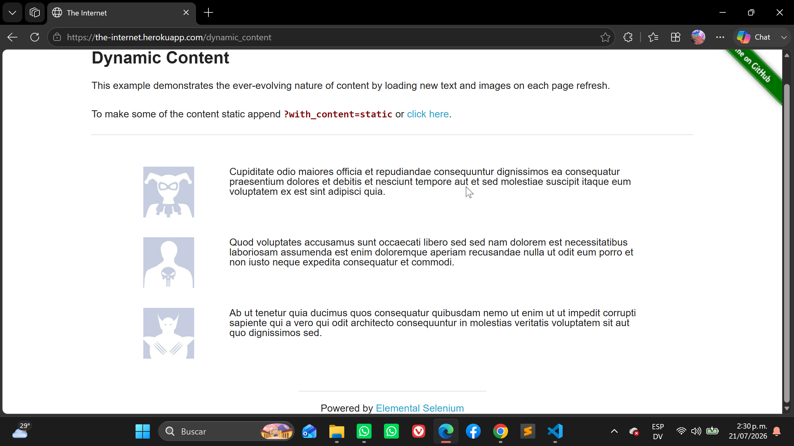
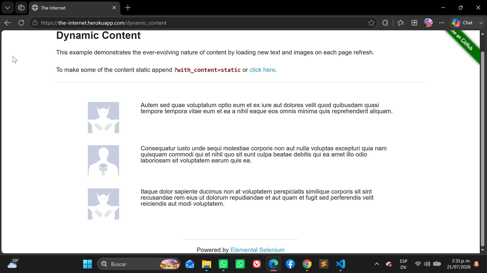
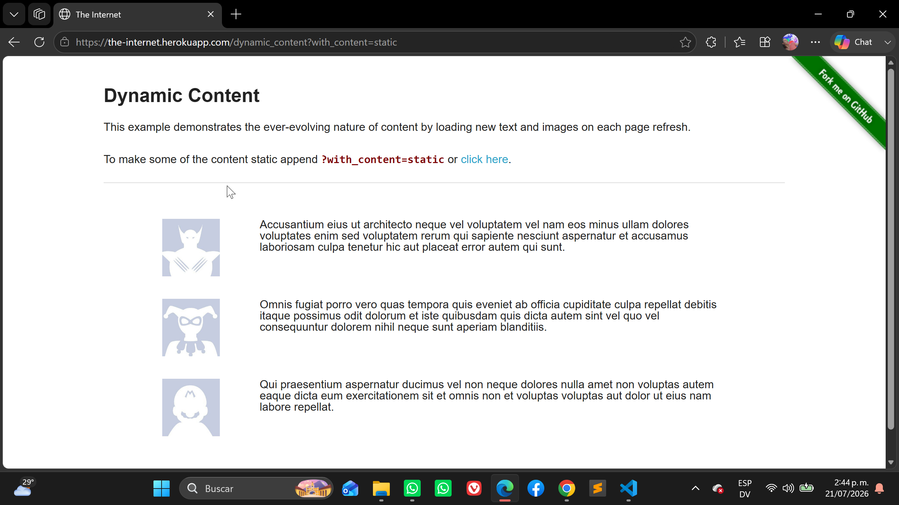
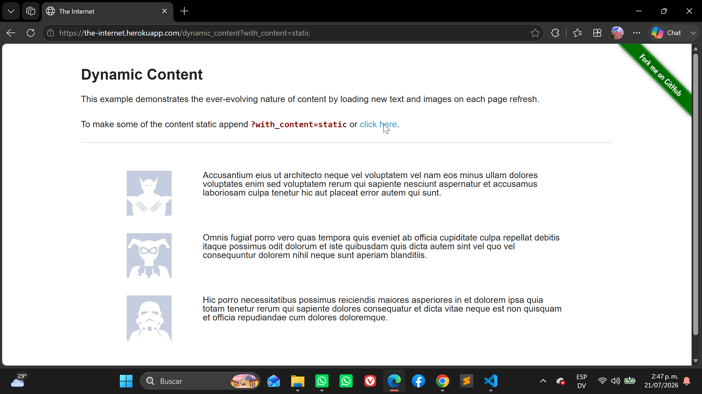

# Exploratory Test

## Feature: Dynamic Content 

* Scenario: Display dynamic content on page load 
    - Given the user navigates to the Dynamic Content page 
    - When the page finishes loading 
    - Then three content sections should be displayed 
    - And each section should contain an image 
    - And each section should contain a text block 
    
     
    
* Scenario: Refresh the dynamic content 
    - Given the user is viewing the Dynamic Content page 
    - When the user refreshes the page 
    - Then the content should be displayed successfully 
    - And the page should not show any errors 
    - And the images and text must be differents 
    
     
     
    
* Scenario: Load another set of dynamic content 
    - Given the user is on the Dynamic Content page 
    - When the user clicks the "click here" link 
    - Then a new page should be loaded 
    - And the dynamic content should be displayed successfully 
    - And the images and text change on some elements 
    
     
     
    
* Scenario: Display static content using the with_content parameter 
    - Given the user accesses the page with the "with_content=static" parameter 
    - When the page loads 
    - Then the content should be displayed successfully 
    - And the text should remain consistent after refreshing the page 
    
    (Bug: el ultimo elemento cambia a pesar de tener el with_content=static)
    
     
     
    
* Scenario: Navigate back to the home page 
    - Given the user is on the Dynamic Content page 
    - When the user clicks the "Elemental Selenium" link 
    - Then the corresponding page should open successfully 
    
    