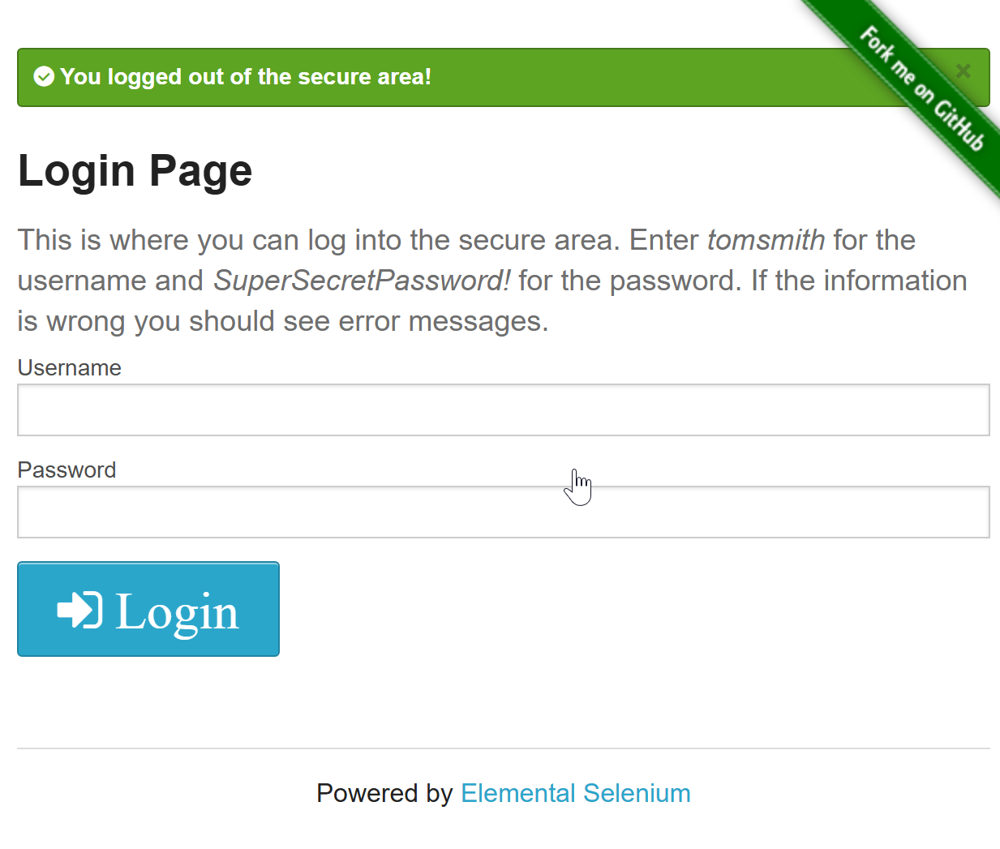
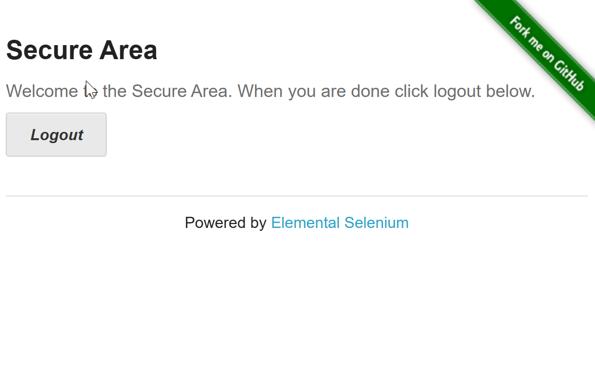

# BUG-1 - Secure Area remains accessible after logout using browser Back button

| Field | Value |
|-------|-------|
| **Module** | Form Authentication |
| **Type** | Functional / Session Management |
| **Severity** | Medium |
| **Priority** | Medium |
| **Status** | Open |

## Description

After logging out, the user can navigate back using the browser's **Back** button and the **Secure Area** page is displayed again instead of requiring authentication.

Although the session appears to be invalid, the protected page remains visible, which may confuse users and expose cached content.

## Preconditions

- The user is logged in successfully.
- The user is on the **Secure Area** page.

## Steps to Reproduce

1. Navigate to **Form Authentication**.
2. Log in using valid credentials:
   - Username: `tomsmith`
   - Password: `SuperSecretPassword!`
3. Verify that the **Secure Area** page is displayed.
4. Click **Logout**.
5. Verify that the application redirects to the login page.
6. Click the browser **Back** button.

## Expected Result

The application should prevent access to the Secure Area after logout. The user should either:

- Be redirected to the login page, or
- Be prompted to authenticate again before viewing protected content.

## Actual Result

The browser displays the Secure Area page after pressing the **Back** button, even though the user has already logged out.

## Evidence

- 
- 
