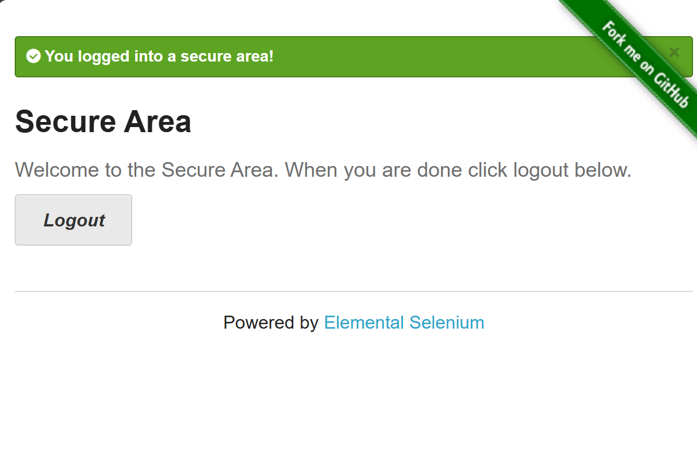
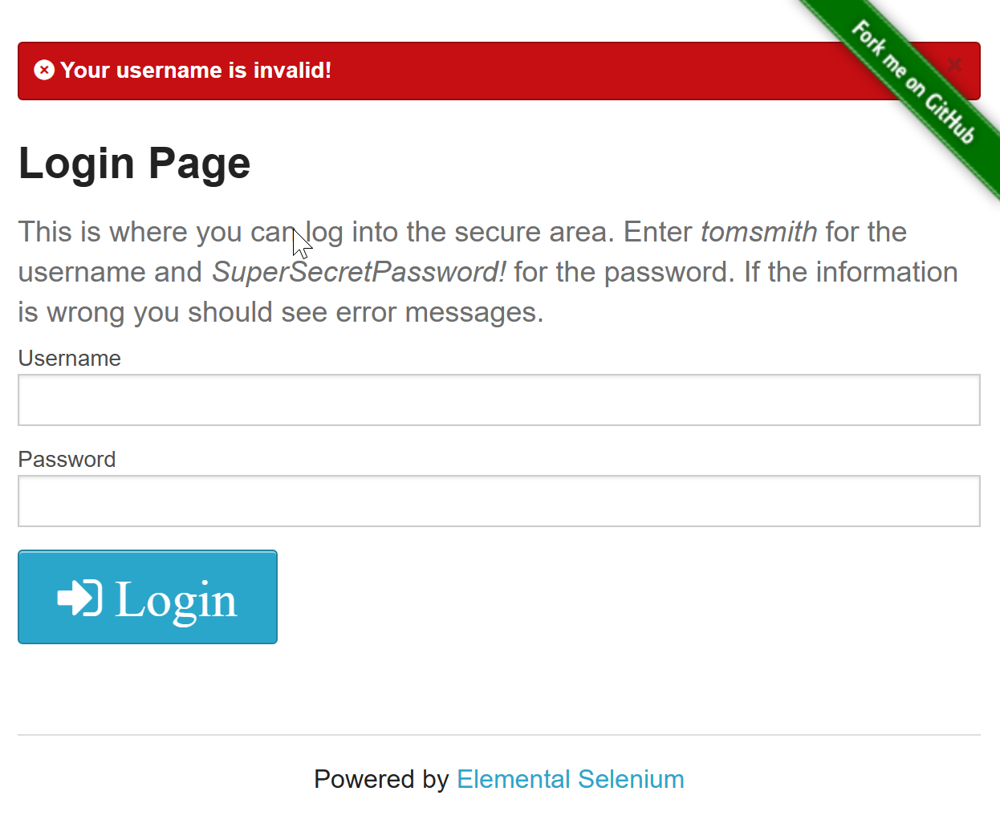
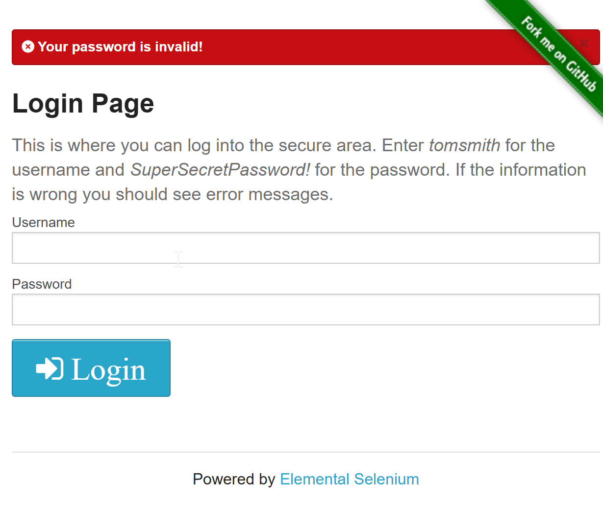
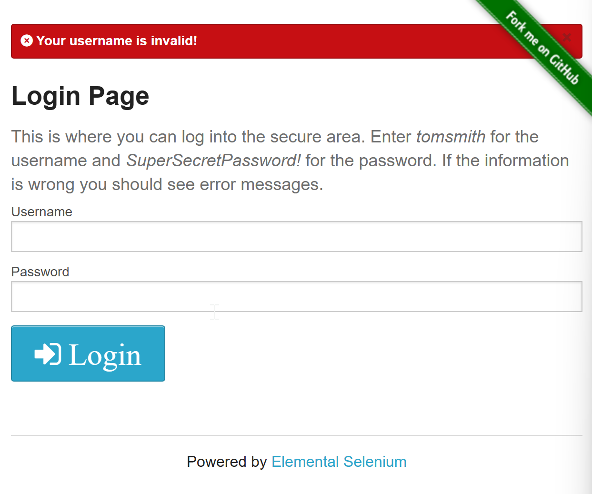
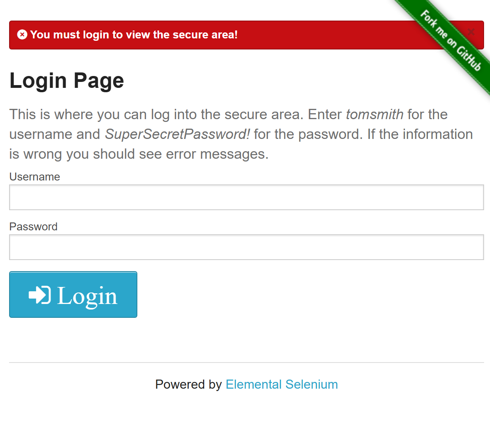
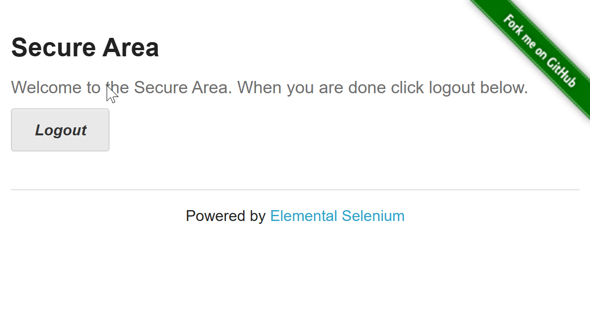

# Exploratory Test

## Feature: Form Authentication

* Scenario: Successful login with valid credentials 
    - Given the user is on the Form Authentication page 
    - When the user enters a valid username (tomsmith) 
    - And the user enters a valid password (SuperSecretPassword!) - And clicks the Login button 
    - Then the user should be redirected to the Secure Area page 
    - And a successful login message should be displayed 
    - And the Logout button should be visible

    
     
* Scenario: Login fails with invalid username 
    - Given the user is on the Form Authentication page 
    - When the user enters an invalid username (testuser) 
    - And enters a valid password (SuperSecretPassword!) 
    - And clicks the Login button 
    - Then the user should remain on the Login page 
    - And an authentication error message should be displayed saying "Your username is invalid" 
    
     
    
* Scenario: Login fails with invalid password 
    - Given the user is on the Form Authentication page 
    - When the user enters a valid username (tomsmith) 
    - And enters an invalid password (invalid) 
    - And clicks the Login button 
    - Then the user should remain on the Login page 
    - And an authentication error message should be displayed saying "Your password is invalid" 
    
     
    
* Scenario: Login fails when fields are empty 
    - Given the user is on the Form Authentication page 
    - When the user leaves username and password empty 
    - And clicks the Login button 
    - Then the user should not be authenticated 
    - And an error message should be displayed saying "Your username is invalid" (Observation: error message with incorrect message "the fields are required") 
    
     
    
* Scenario: Access secure area without authentication 
    - Given the user is not authenticated 
    - When the user navigates directly to the Secure Area URL (https://the-internet.herokuapp.com/secure) 
    - Then the user should not access protected content 
    - And the user should be redirected to the Login page 
    
     
    
* Scenario: User session remains active after page refresh 
    - Given the user is logged into the Secure Area 
    - When the user refreshes the browser 
    - Then the user should remain authenticated 
    - And the secure area should still be displayed 
    - And the success login message dissapear 
    
     
    
* Scenario: User cannot access secure area after logout using browser navigation 
- Given the user has logged out 
- When the user clicks the browser Back button 
- Then the secure area should not be displayed 
- And the user should be required to authenticate again 

    
    