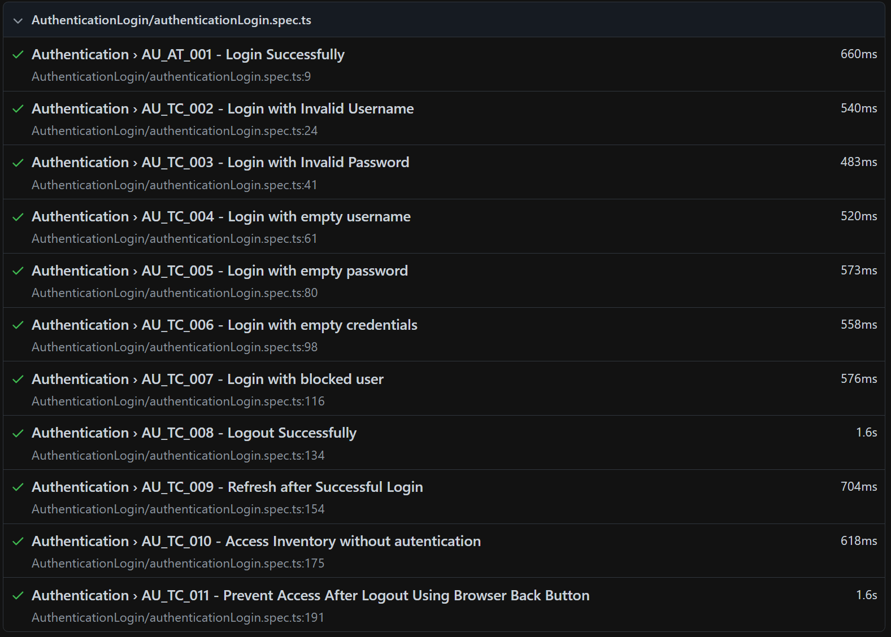
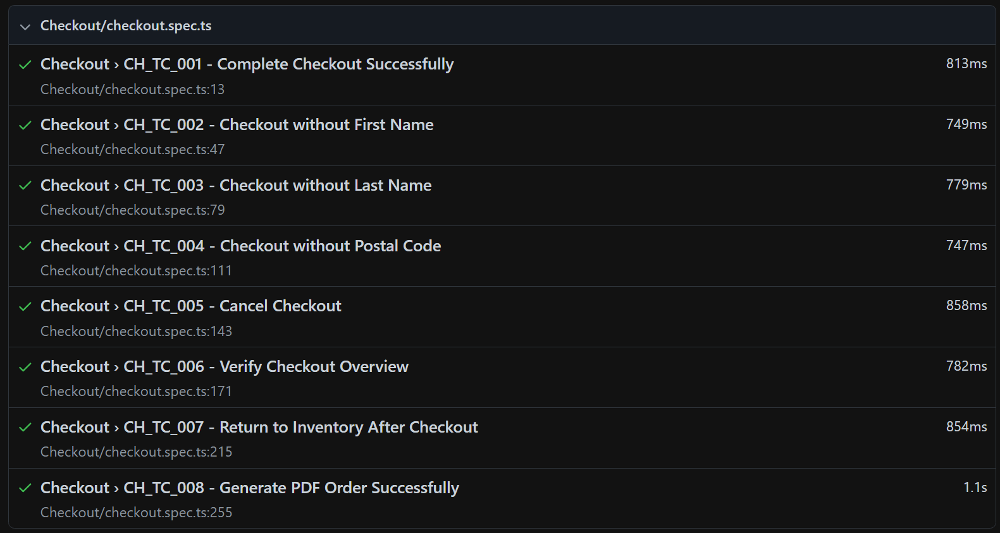
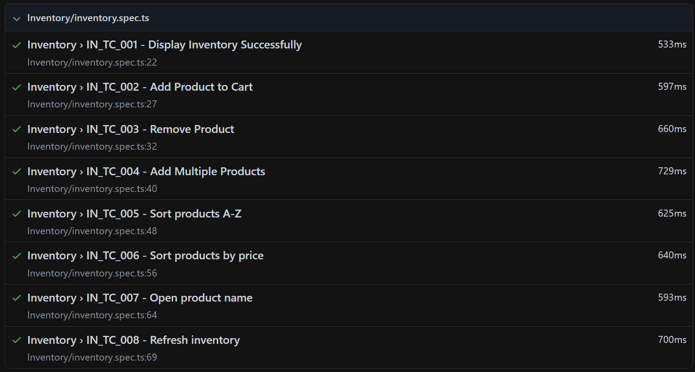
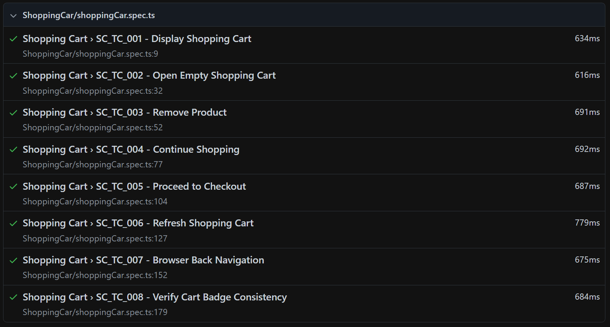

# QA Automation Challenge - Exercise 2

## Overview

This repository contains the solution for **Exercise 2** of the QA Automation Challenge.

The objective of this exercise is to validate the functionality of the SauceDemo application by applying both manual and automated testing techniques.

The project includes:

- QA Planning
- Exploratory Testing
- Functional Test Cases
- Test Execution
- Bug Reporting
- Test Automation using Playwright

---

# Application Under Test

**Website**

https://www.saucedemo.com/

---

# Deliverables

The repository includes:

- QA Planning
- Exploratory Testing
- Functional Test Cases
- Test Execution
- Playwright Automation
- Test Evidence (Screenshots)

Bug management was performed using Trello.

---

# Bug Tracking

All identified defects have been documented in a Trello board including:

- Bug Summary
- Description
- Steps to Reproduce
- Expected Result
- Actual Result
- Severity
- Priority
- Evidence

**Trello Board**

> https://trello.com/invite/b/6a6566e3104cd8f9aec875f8/ATTIf28b2cfc6b2762a3f752590b7ca8b4016673573E/saucedemo-bug-exercise-2

---

# Tested Modules

The following modules were tested:

- Authentication Login
- Inventory
- Shopping Cart
- Checkout
- Generate PDF Order

---

# Automation Framework

The automation framework was developed using:

- Playwright
- TypeScript
- Page Object Model (POM)

The project follows the Page Object Model pattern by separating:

- **Fixtures:** Test data and expected messages.
- **Page Objects:** UI interactions.
- **Spec Files:** Test flow and assertions.

This structure improves readability, scalability and maintainability.

---

# Running the Tests

Install dependencies:

```bash
npm install
```

Run all tests:

```bash
npx playwright test
```
---

# Test Report

## Authentication Login


## Checkout


## Inventory


## ShoppingCar


---

# References

## Application Under Test

https://www.saucedemo.com/

## Bug Tracking

https://trello.com/invite/b/6a6566e3104cd8f9aec875f8/ATTIf28b2cfc6b2762a3f752590b7ca8b4016673573E/saucedemo-bug-exercise-2


---

# Author

QA Automation Challenge

Developed using Playwright and TypeScript.