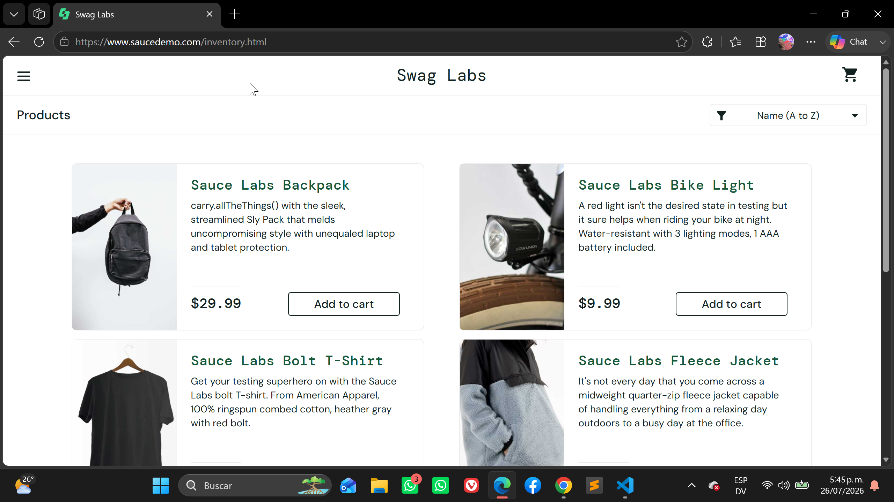
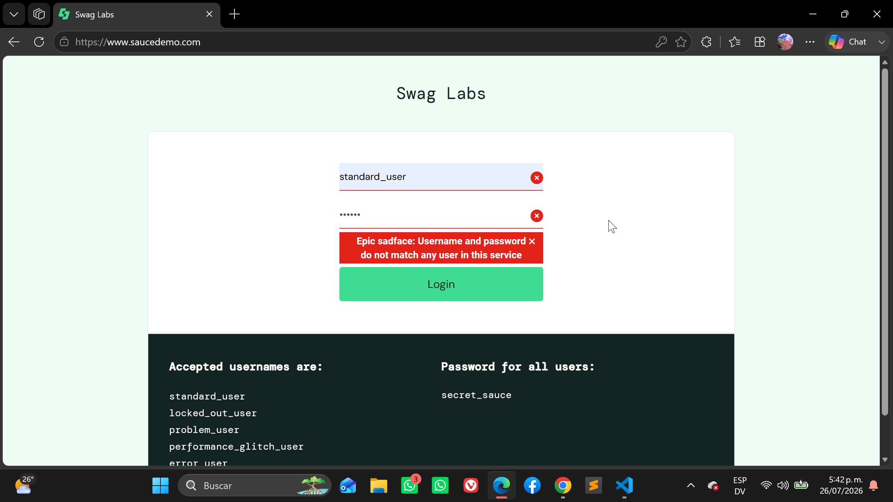
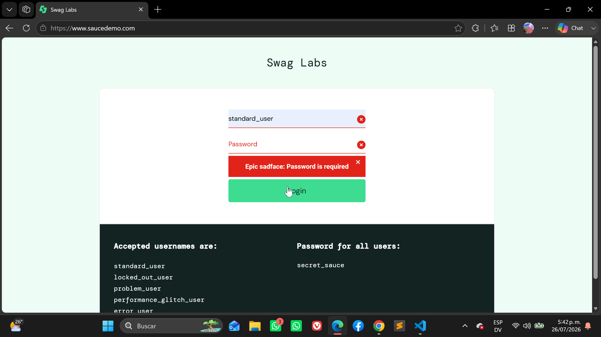
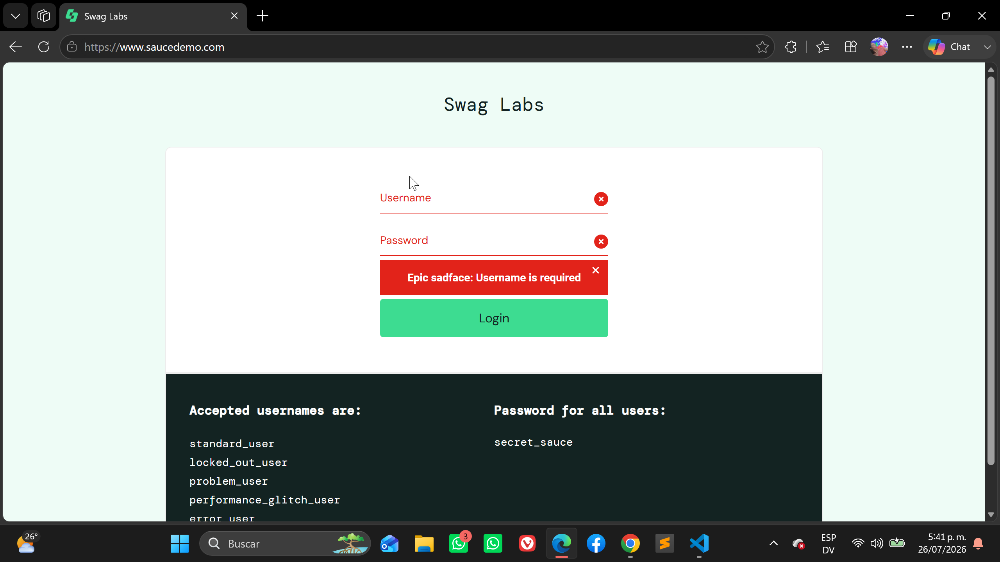
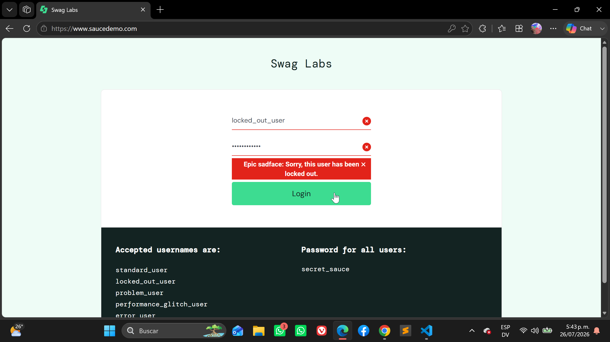
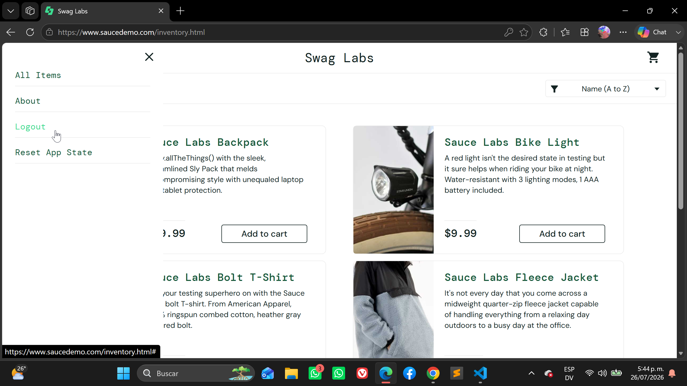
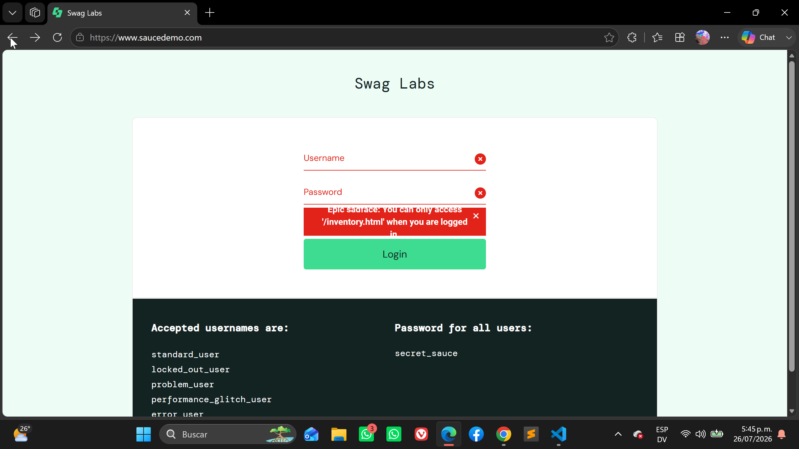
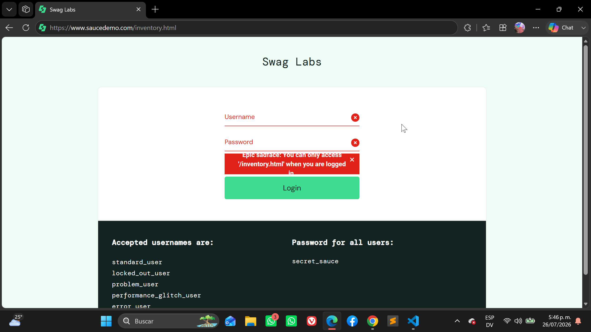

# Exploratory Testing

## Module: Authentication

---

### Scenario: Login with valid credentials

- **Given** the user is on the Login page
- **When** the user enters a valid username (`standard_user`)
- **And** enters the valid password (`secret_sauce`)
- **And** clicks the **Login** button
- **Then** the Inventory page should be displayed
- **And** the **Products** title should be visible

**Observation:** Login completed successfully and the user was redirected to the Inventory page.

**Result:** ✅ Pass

**Evidence:** 

---

### Scenario: Login with an invalid username

- **Given** the user is on the Login page
- **When** the user enters an invalid username
- **And** enters a valid password
- **And** clicks **Login**
- **Then** an authentication error message should be displayed
- **And** the user should remain on the Login page

**Observation:** The application prevented access and displayed the expected error message.

**Result:** ✅ Pass

**Evidence:** 

---

### Scenario: Login with an invalid password

- **Given** the user is on the Login page
- **When** the user enters a valid username
- **And** enters an invalid password
- **And** clicks **Login**
- **Then** an authentication error message should be displayed
- **And** the user should remain on the Login page

**Observation:** Login failed as expected and the appropriate error message was displayed.

**Result:** ✅ Pass

**Evidence:** 

---

### Scenario: Login with empty username

- **Given** the user is on the Login page
- **When** the username field is left empty
- **And** a valid password is entered
- **And** the user clicks **Login**
- **Then** the application should prevent authentication
- **And** a validation message should be displayed

**Observation:** The application correctly required the username field.

**Result:** ✅ Pass

**Evidence:** 

---

### Scenario: Login with empty password

- **Given** the user is on the Login page
- **When** a valid username is entered
- **And** the password field is left empty
- **And** the user clicks **Login**
- **Then** the application should prevent authentication
- **And** a validation message should be displayed

**Observation:** The application correctly required the password field.

**Result:** ✅ Pass

**Evidence:** 

---

### Scenario: Login with empty credentials

- **Given** the user is on the Login page
- **When** both username and password fields are empty
- **And** the user clicks **Login**
- **Then** authentication should not be allowed
- **And** a validation message should be displayed

**Observation:** The application prevented login and displayed the expected validation message.

**Result:** ✅ Pass

**Evidence:** 

---

### Scenario: Login using a locked user

- **Given** the user is on the Login page
- **When** the user enters the credentials of `locked_out_user`
- **And** clicks **Login**
- **Then** access should be denied
- **And** an informative error message should be displayed

**Observation:** The application correctly blocked access for the locked user.

**Result:** ✅ Pass

**Evidence:** 

---

### Scenario: Logout 

- **Given** the user is on the inventory page
- **When** the user click on the slidebar menue
- **And*** click on the logout button
- **Then** the user logout
- **And** the user is redirect to login page

**Observation:** the user is redirected to login page.

**Result:** ✅ Pass

**Evidence:** 
---

### Scenario: Refresh the page after login

- **Given** the user is authenticated
- **When** the browser page is refreshed
- **Then** the session should remain active
- **And** the Inventory page should still be displayed

**Observation:** The session persisted after refreshing the page.

**Result:** ✅ Pass

**Evidence:** 

---

### Scenario: Prevent access after logout using browser Back button

  - Given the user is logged into the application
  - And the user logs out successfully
  - When the user clicks the browser Back button
  - Then the Inventory page should not be accessible
  - And the user should be redirected to the Login page
  - And the user should be required to authenticate again

**Observation:** the user don't redirect to inventory page.

**Result:** ✅ Pass

**Evidence:** 

---

### Scenario: Access the Inventory page without authentication

- **Given** the user is not authenticated
- **When** the user attempts to access the Inventory URL directly
- **Then** access should be denied
- **And** the Login page should be displayed

**Observation:** The application redirected the user to the Login page, preventing unauthorized access.

**Result:** ✅ Pass

**Evidence:** 

