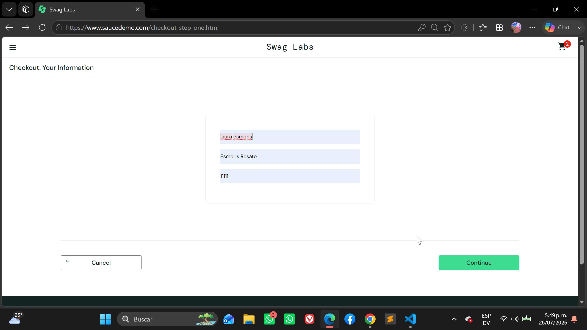
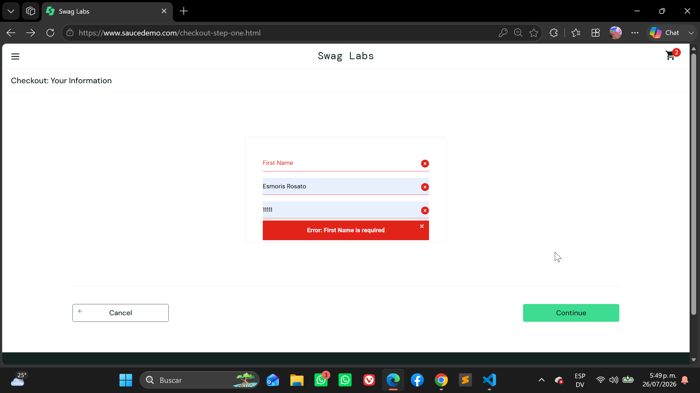
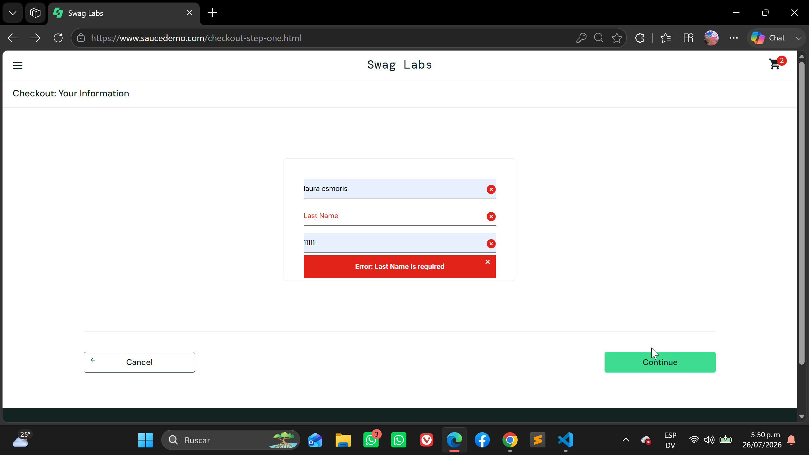
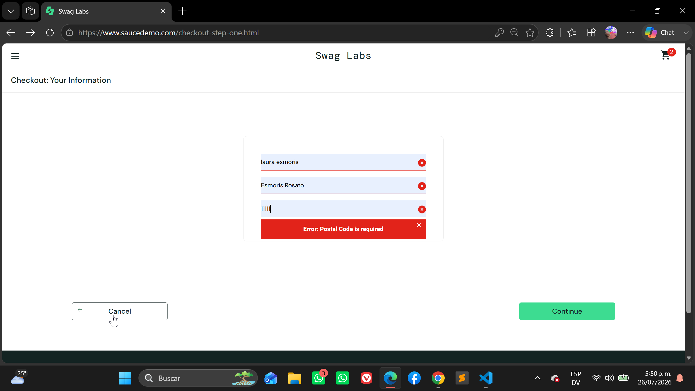
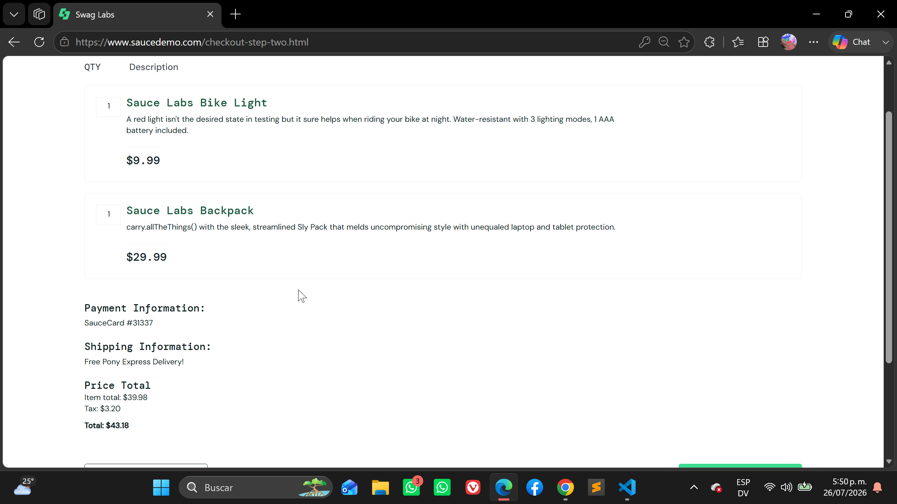
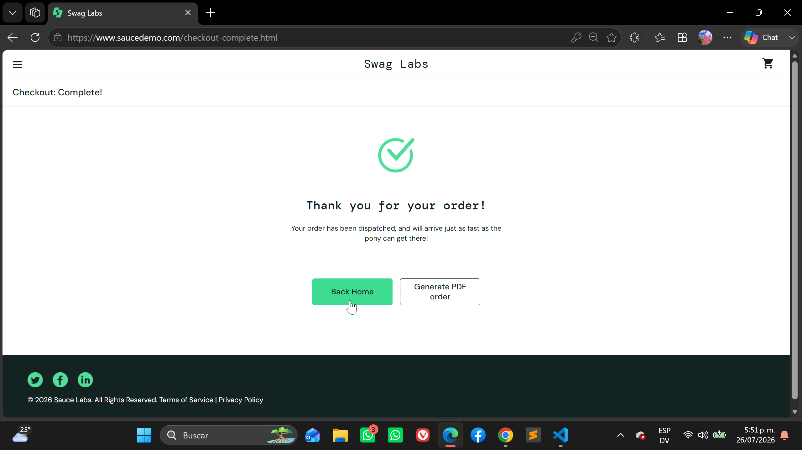

## Feature: Checkout

* Scenario: Complete checkout successfully

  - Given the user has at least one product in the shopping cart
  - And the user navigates to the Checkout page
  - When the user enters valid customer information
  - And clicks the Continue button
  - And reviews the order summary
  - And clicks the Finish button
  - Then the order should be completed successfully
  - And a confirmation message should be displayed

---

* Scenario: Checkout with empty First Name

  - Given the user is on the Checkout Information page
  - When the First Name field is left empty
  - And valid Last Name and Postal Code are entered
  - And the user clicks Continue
  - Then the checkout process should not continue
  - And the message "First Name is required" should be displayed

---

* Scenario: Checkout with empty Last Name

  - Given the user is on the Checkout Information page
  - When the Last Name field is left empty
  - And valid First Name and Postal Code are entered
  - And the user clicks Continue
  - Then the checkout process should not continue
  - And the message "Last Name is required" should be displayed

---

* Scenario: Checkout with empty Postal Code

  - Given the user is on the Checkout Information page
  - When the Postal Code field is left empty
  - And valid First Name and Last Name are entered
  - And the user clicks Continue
  - Then the checkout process should not continue
  - And the message "Postal Code is required" should be displayed

---

* Scenario: Cancel checkout

  - Given the user is on the Checkout Information page
  - When the user clicks the Cancel button
  - Then the user should return to the Cart page
  - And the products in the cart should remain unchanged

---

* Scenario: Verify checkout overview information

  - Given the user completed the customer information
  - When the Checkout Overview page is displayed
  - Then the selected products should be displayed
  - And the payment information should be displayed
  - And the shipping information should be displayed
  - And the item total, tax and total should be calculated correctly

---

* Scenario: Return to inventory after completing checkout

  - Given the order has been completed successfully
  - When the user clicks Back Home
  - Then the Inventory page should be displayed

  