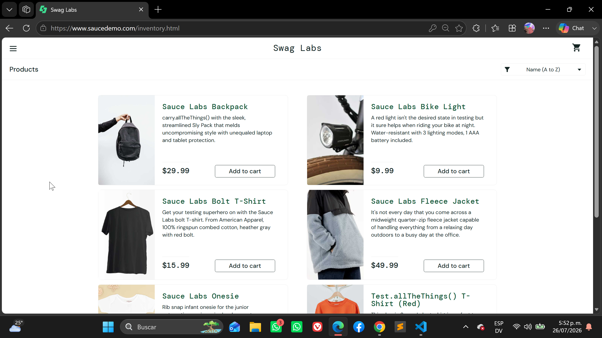
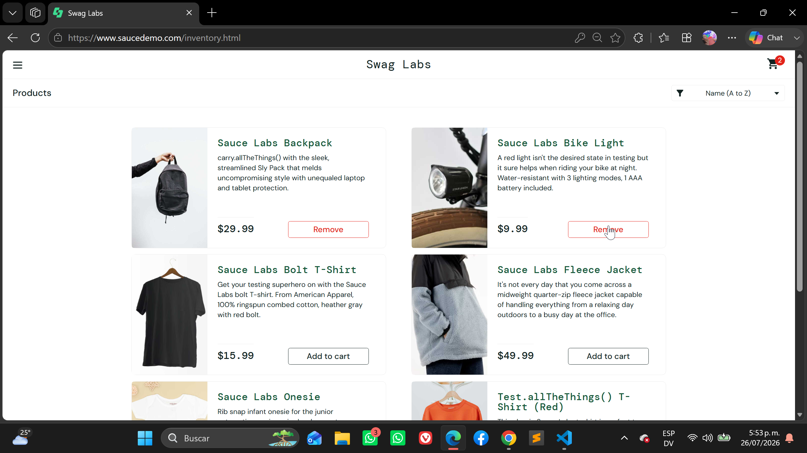
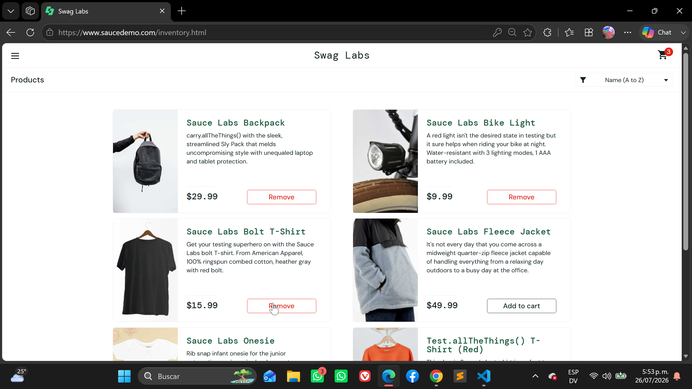
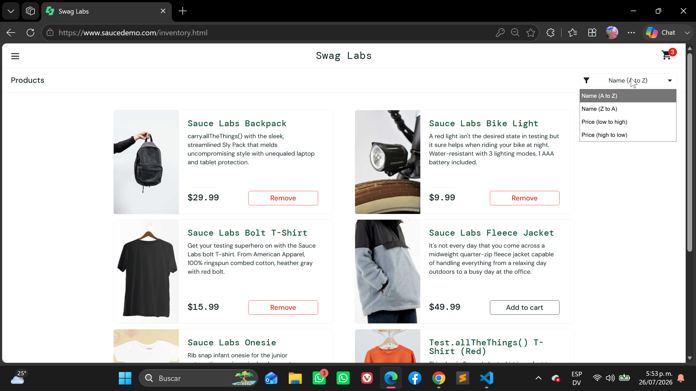
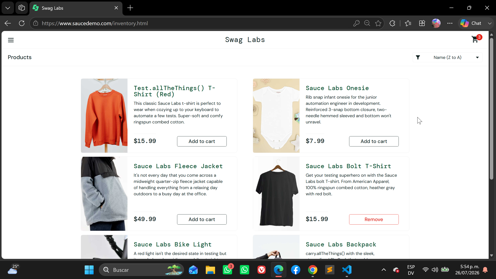
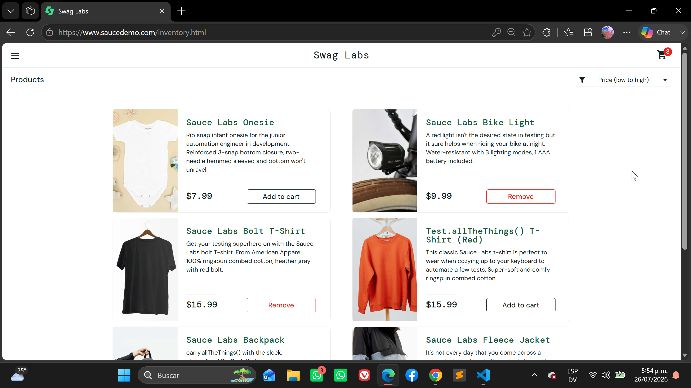
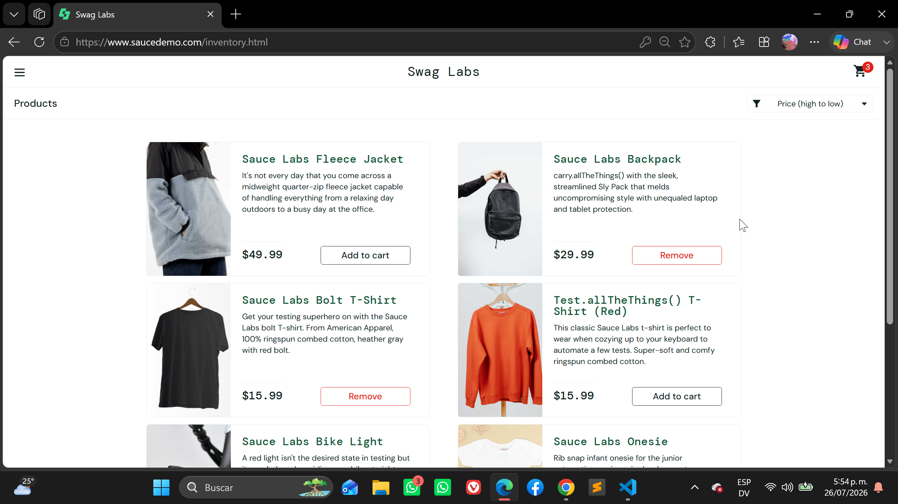
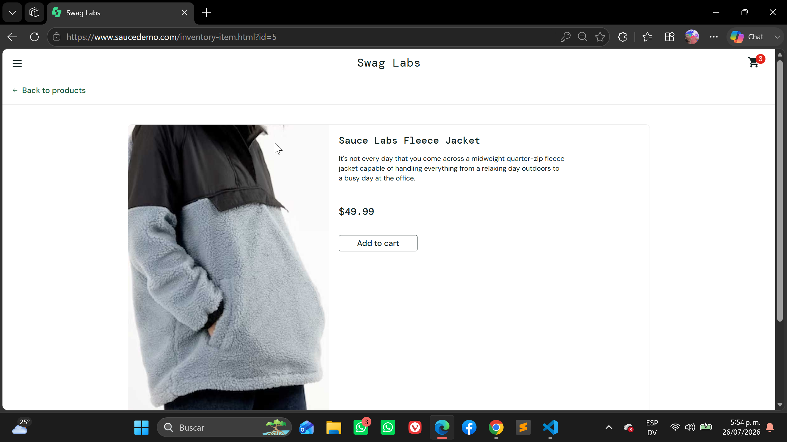

# Exploratory Test

## Feature: Inventory Page

### Scenario: Display inventory after successful login

- Given the user has logged in successfully
- When the Inventory page is displayed
- Then the products list should be visible
- And each product should display:
  - Product image
  - Product name
  - Product description
  - Product price
  - Add to Cart button

---

### Scenario: Add a product to the cart

- Given the user is on the Inventory page
- When the user clicks "Add to Cart" for a product
- Then the button should change to "Remove"
- And the cart badge should display "1"

---

### Scenario: Remove a product from the cart

- Given the user added a product to the cart
- When the user clicks "Remove"
- Then the button should change back to "Add to Cart"
- And the cart badge should disappear

---

### Scenario: Add multiple products

- Given the user is on the Inventory page
- When the user adds multiple products
- Then the shopping cart badge should display the correct quantity

---

### Scenario: Sort products by Name (A to Z)

- Given the user is viewing the Inventory page
- When the user selects "Name (A to Z)"
- Then the products should be sorted alphabetically

---

### Scenario: Sort products by Name (Z to A)

- Given the user is viewing the Inventory page
- When the user selects "Name (Z to A)"
- Then the products should be sorted in reverse alphabetical order

---

### Scenario: Sort products by Price (Low to High)

- Given the user is viewing the Inventory page
- When the user selects "Price (Low to High)"
- Then the products should be sorted by ascending price

---

### Scenario: Sort products by Price (High to Low)

- Given the user is viewing the Inventory page
- When the user selects "Price (High to Low)"
- Then the products should be sorted by descending price

---

### Scenario: Open product details

- Given the user is on the Inventory page
- When the user clicks on a product name or image
- Then the Product Details page should be displayed

---

### Scenario: Refresh inventory page

- Given the user is on the Inventory page
- When the user refreshes the browser
- Then the user should remain logged in
- And the selected products should remain in the cart

