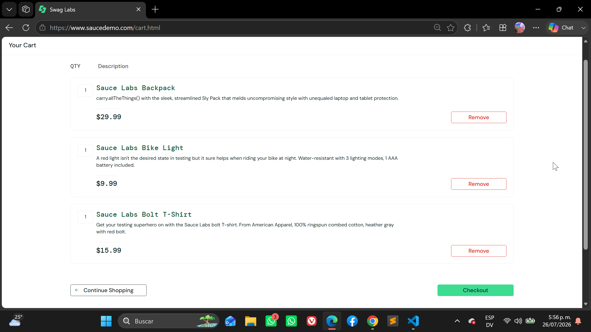
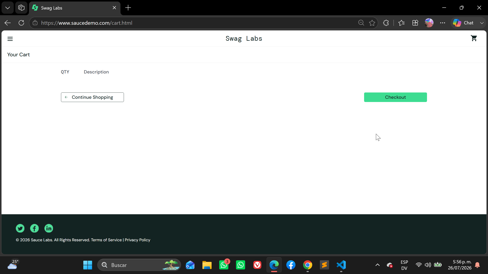
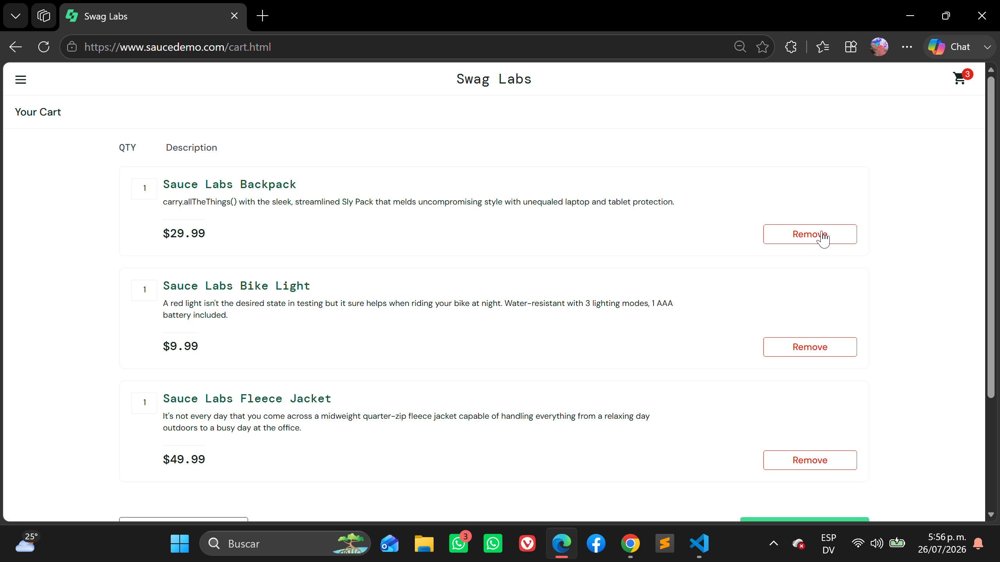
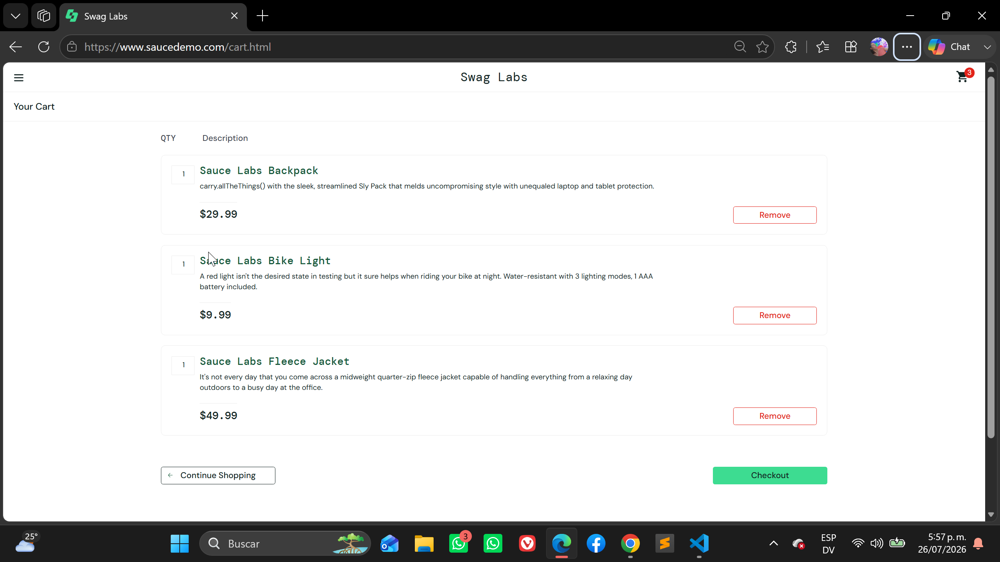
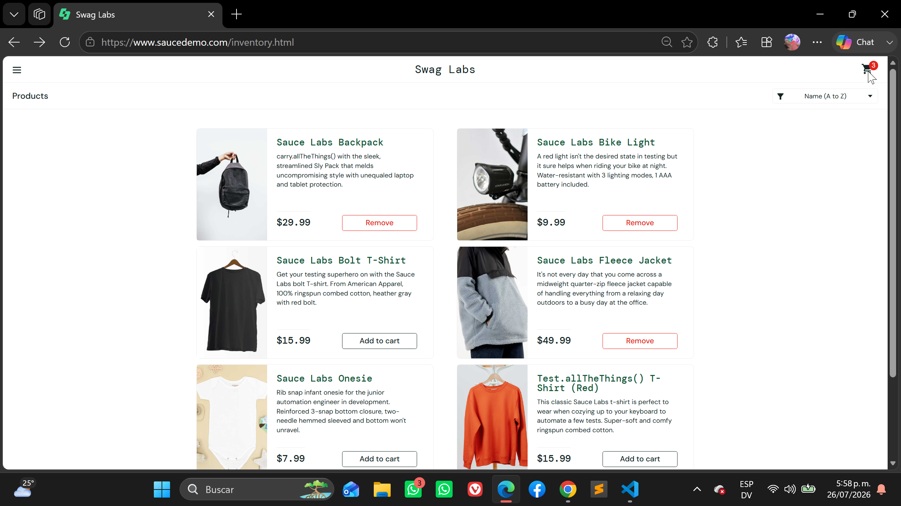

# Exploratory Test

## Feature: Shopping Cart

### Scenario: Display shopping cart

- Given the user has added at least one product to the cart
- When the user opens the Shopping Cart
- Then all selected products should be displayed
- And each product should display:
  - Product name
  - Description
  - Price
  - Quantity
  - Remove button

---

### Scenario: Open an empty shopping cart

- Given the user has not added any products
- When the user opens the Shopping Cart
- Then the cart should be displayed
- And no products should be listed
- And the Checkout button should remain available

---

### Scenario: Remove a product from the cart

- Given the user has products in the Shopping Cart
- When the user clicks Remove
- Then the selected product should be removed
- And the cart badge should be updated

---

### Scenario: Continue shopping

- Given the user is viewing the Shopping Cart
- When the user clicks Continue Shopping
- Then the Inventory page should be displayed
- And the selected products should remain in the cart

---

### Scenario: Proceed to checkout

- Given the Shopping Cart contains at least one product
- When the user clicks Checkout
- Then the Checkout Information page should be displayed

---

### Scenario: Refresh Shopping Cart

- Given the user has products in the Shopping Cart
- When the user refreshes the browser
- Then the Shopping Cart should remain displayed
- And the selected products should remain in the cart

---

### Scenario: Navigate back from Shopping Cart

- Given the user is on the Shopping Cart page
- When the user clicks the browser Back button
- Then the Inventory page should be displayed
- And the cart contents should be preserved

---

### Scenario: Verify cart badge consistency

- Given the user has added multiple products
- When the user opens the Shopping Cart
- Then the number of displayed products should match the cart badge

